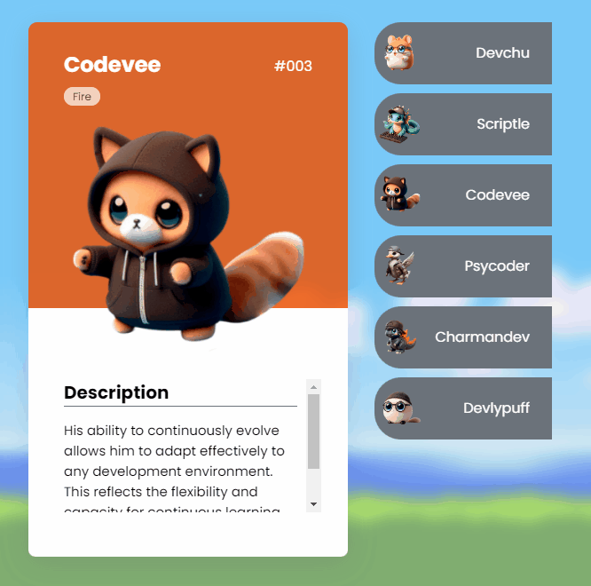

# Project Pokedevs

This is a simple project that creates a list of pokémons, where each has programmer characteristics. The user can switch between the pokémon "cards" by clicking on an item in the list.

# 
#### Screen project Pokedevs

## Technologies used

- HTML 
- CSS 
- JS

## Features

The application allows switching between the pokémon cards listed. When the user clicks on a name in the list, the corresponding card is displayed, and the currently open card is closed.

## How to Use

Clone this repository and open the index.html file in your browser to view the project.

 # Social media

 - 👋🏾 [Linkedin](https://www.linkedin.com/in/matheus17martins/)
 - 💻 [Github](https://github.com/ma17martins)